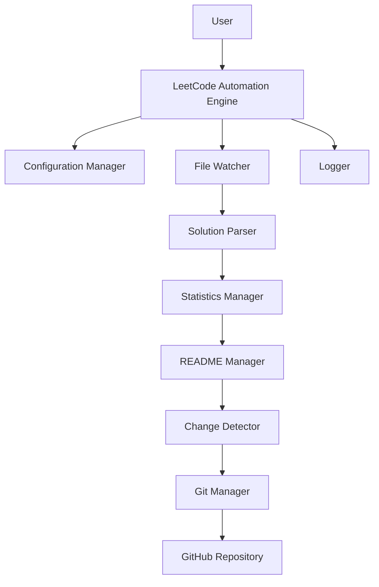

# Architecture

```mermaid
flowchart TD

    A[User] --> B[LeetCode Automation Engine]

    B --> C[Configuration Manager]
    B --> D[File Watcher]
    B --> E[Logger]

    D --> F[Solution Parser]
    F --> G[Statistics Manager]
    G --> H[README Manager]
    H --> I[Change Detector]
    I --> J[Git Manager]
    J --> K[GitHub Repository]
```
